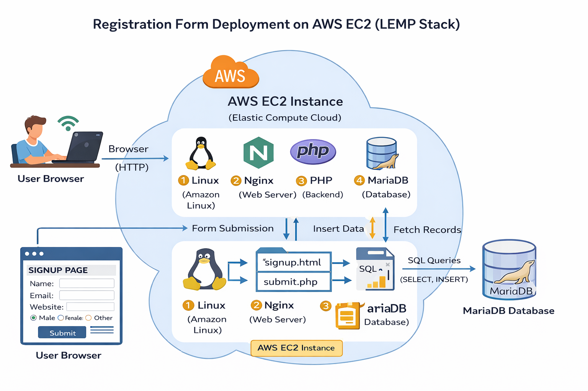
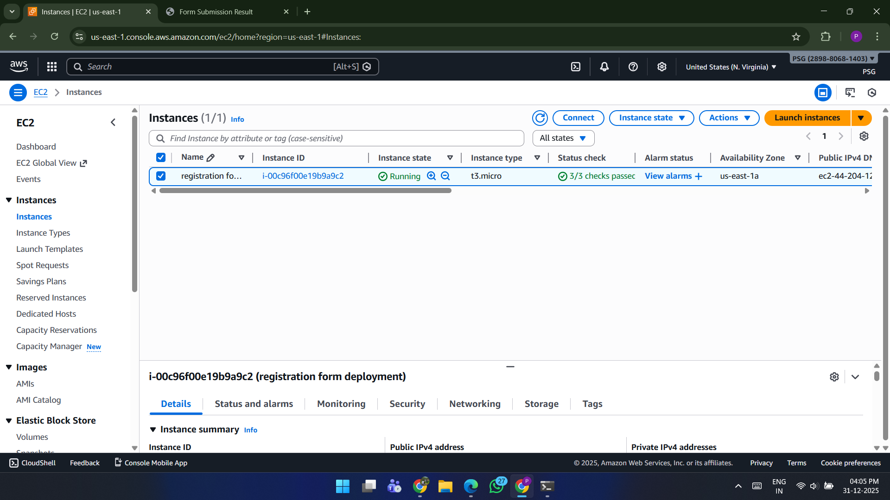
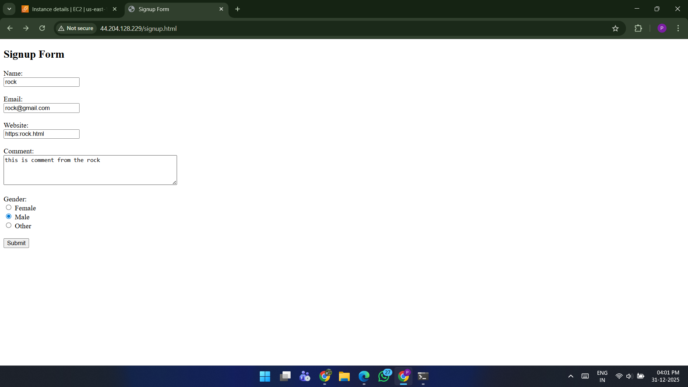
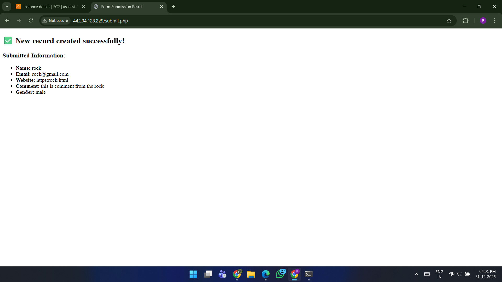
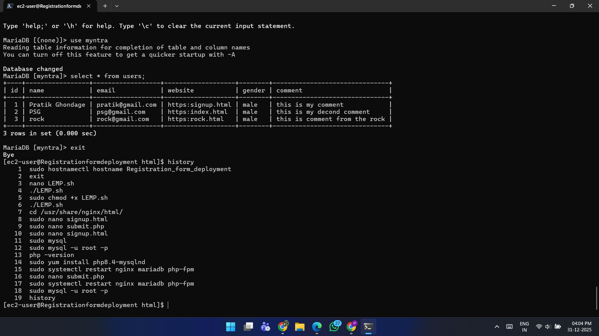

# Registration Form Deployment on AWS EC2 (LEMP Stack)

## Introduction

In this project, I deployed a Registration Form application on an AWS EC2 instance using the LEMP stack (Linux, Nginx, MariaDB, PHP).

The goal was to host a signup form on EC2, store user input in a MariaDB database, and finally verify the submitted records directly from the database.

LEMP stands for:

- Linux — Operating system (Amazon Linux)  
- Nginx — Web server to handle HTTP requests  
- MariaDB — Database to store user data  
- PHP — Server-side scripting language to process form data  

A dynamic website is one where content is generated in real time based on user interaction. In this project, user input from a signup form is processed by PHP and stored dynamically in a database instead of showing static content only.

This project demonstrates end-to-end deployment, including server setup, application hosting, database integration, and verification.

## Project Objective

- Launch an EC2 instance and configure web access  
- Install and configure Nginx, PHP, and MariaDB  
- Deploy a dynamic signup/registration form  
- Store user input in a database  
- Verify stored records using SQL queries  

## Architecture Overview

User Browser → Nginx Web Server → PHP Backend → MariaDB Database

- EC2 hosts the application  
- Nginx serves the HTML and PHP files  
- PHP handles form submission  
- MariaDB stores user data  

  
img 1

## Step-by-Step Implementation

### Step 1: EC2 Instance Creation

- Created an EC2 instance named Registration_form_deployment  
- Enabled ports:  
  - 22 (SSH) — Remote access  
  - 80 (HTTP) — Web traffic  
- Connected to the instance using SSH  

```
ssh -i key.pem ec2-user@<public-ip>
```

  

### Step 2: Install LEMP Stack Using Automation Script (LEMP.sh)

In this step, instead of running individual commands manually, I created a shell script `LEMP.sh` and executed it to install and configure the LEMP stack.

#### Create LEMP.sh Script

```
nano LEMP.sh
```

#### Commands Added Inside LEMP.sh

```
sudo yum update -y
sudo yum install nginx mariadb105-server php -y
sudo systemctl start nginx mariadb php-fpm
sudo systemctl enable nginx mariadb php-fpm
cd /usr/share/nginx/html/
sudo touch index.html
echo "<h1>welcome to my demo website</h1>" > index.html
```

#### Make Script Executable

```
sudo chmod +x LEMP.sh
```

#### Execute the Script

```
./LEMP.sh
```

After executing the script, the LEMP stack was installed and configured successfully and a demo webpage was created to verify Nginx.

### Step 3: Configure Web Directory

```
cd /usr/share/nginx/html/
sudo touch index.html
echo "<h1>Welcome to my demo website</h1>" > index.html
```

### Step 4: Create Signup Page (signup.html)

Created an HTML form to collect user information such as name, email, website, comment, and gender.

```
<!DOCTYPE html>
<html>
<head>
<title>Signup Form</title>
</head>
<body>
<h2>Signup Form</h2>
<form action="submit.php" method="post">
<label for="name">Name:</label><br>
<input type="text" id="name" name="name" required><br><br>
<label for="email">Email:</label><br>
<input type="email" id="email" name="email" required><br><br>
<label for="website">Website:</label><br>
<input type="url" id="website" name="website"><br><br>
<label for="comment">Comment:</label><br>
<textarea id="comment" name="comment" rows="4" cols="50"></textarea><br><br>
<label>Gender:</label><br>
<input type="radio" id="female" name="gender" value="female" required>
<label for="female">Female</label><br>
<input type="radio" id="male" name="gender" value="male">
<label for="male">Male</label><br>
<input type="radio" id="other" name="gender" value="other">
<label for="other">Other</label><br><br>
<input type="submit" value="Submit">
</form>
</body>
</html>
```

### Step 5: Create PHP Backend (submit.php)

The `submit.php` file processes form data using PHP and inserts it into the MariaDB database.

```
<?php
error_reporting(E_ALL);
ini_set('display_errors', 1);

// Get form data
$name = $_POST['name'];
$email = $_POST['email'];
$website = $_POST['website'];
$comment = $_POST['comment'];
$gender = $_POST['gender'];

// Database connection details
$servername = "localhost";
$username = "root";
$password = "root";
$dbname = "myntra";

// Create connection
$conn = mysqli_connect($servername, $username, $password, $dbname);

// Check connection
if (!$conn) {
    die("Connection failed: " . mysqli_connect_error());
}

// Insert query
$sql = "INSERT INTO users (name, email, website, comment, gender)
VALUES ('$name', '$email', '$website', '$comment', '$gender')";
?>

<!DOCTYPE html>
<html>
<head>
<title>Form Submission Result</title>
</head>
<body>

<?php
if (mysqli_query($conn, $sql)) {
    echo "<h2>New record created successfully!</h2>";
    echo "<h3>Submitted Information:</h3>";
    echo "<ul>";
    echo "<li><strong>Name:</strong> " . htmlspecialchars($name) . "</li>";
    echo "<li><strong>Email:</strong> " . htmlspecialchars($email) . "</li>";
    echo "<li><strong>Website:</strong> " . htmlspecialchars($website) . "</li>";
    echo "<li><strong>Comment:</strong> " . htmlspecialchars($comment) . "</li>";
    echo "<li><strong>Gender:</strong> " . htmlspecialchars($gender) . "</li>";
    echo "</ul>";
} else {
    echo "<h3>Error: " . mysqli_error($conn) . "</h3>";
}

mysqli_close($conn);
?>

</body>
</html>
```

### Step 6: Database Configuration

```
CREATE DATABASE myntra;
USE myntra;

CREATE TABLE users (
id INT AUTO_INCREMENT PRIMARY KEY,
name VARCHAR(20),
email VARCHAR(100),
website VARCHAR(255),
gender VARCHAR(6),
comment VARCHAR(100)
);
```

### Step 7: Install PHP–MySQL Connector

```
sudo yum install php8.4-mysqlnd
```

### Step 8: Restart Services

```
sudo systemctl restart nginx mariadb php-fpm
```

### Step 9: Access Signup Page and Submit Form

- Opened a browser  
- Entered the EC2 public IP address  
- Accessed the signup page:

```
http://<EC2-Public-IP>/signup.html
```

- Filled in the registration form with user details  
- Clicked Submit  
- Data was sent to `submit.php` and processed by PHP  

This step confirms that the website is dynamic as data changes based on user input.

  

  

### Step 10: Verification

Verified stored data in the database using:

```
SELECT * FROM users;
```

The submitted form data appeared successfully in the `users` table.

  

## Conclusion

In this project, I successfully deployed a dynamic registration form application on AWS EC2 using the LEMP stack.

This hands-on implementation helped me understand real-world concepts such as server configuration, dynamic web application flow, PHP–database integration, and cloud-based deployment.
